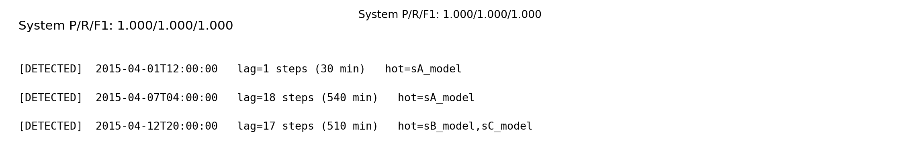
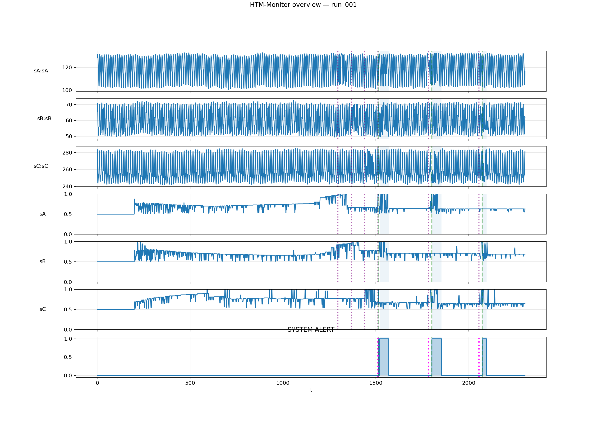

# HTM-Monitor

Real-time anomaly detection for streaming time series using **Hierarchical Temporal Memory (HTM)**.

HTM-Monitor is built for “monitoring” style problems:
- you have one or more signals streaming over time
- the system learns the normal pattern online
- it produces per-signal anomaly probabilities
- it converts those into a single **system alert**

---

## Live demo (streaming detection)

> This is the primary “what it does” view: signals stream in, HTM learns normal behavior,
> anomalies begin, probabilities rise, and a system alert triggers.


Legend (what you’re seeing):
- **value(s)**: incoming signal values
- **HTM raw anomaly score**: the raw HTM anomaly signal (noisy but useful)
- **HTM anomaly probability**: the main interpretable score (0..1)
- **pink spans**: model is “hot” (above decision threshold / counted as suspicious)
- **purple dotted lines**: ground truth anomaly timestamps
- **system alert**: final decision combining models

---

## System evaluation (did it detect the known events?)

This run is scored against known ground-truth anomaly timestamps.



And here’s a static overview plot for the same run (useful when you don’t want animation):



Artifacts are written to a run directory:

```
outputs/<usecase>/<run_id>/
  run.csv
  run.manifest.json
  analysis/
    run_summary.json
    run_summary.md
```

That means runs are:
- reproducible
- easy to diff
- easy to share (send the run folder)

---

## Quickstart: run the demo locally

### 1) Install

```bash
python -m venv .venv
source .venv/bin/activate
pip install -r requirements.txt
```

### 2) Run one command

```bash
python quickstart.py --usecase demo_synth --mode synth --run-id run_001 --make-gif
```

What it does:
1. generates synthetic proof data with subtle injected anomalies
2. builds a demo config (`configs/demo_synth.yaml`)
3. runs the pipeline (optionally showing the live plot)
4. analyzes results + writes a scorecard
5. (optional) records frames and writes `assets/live_demo.gif`

Outputs you’ll care about:
- `assets/live_demo.gif` *(README asset)*
- `assets/system_eval_scorecard.png` *(README asset)*
- `assets/run_overview.png` *(README asset)*

---

## Bring your own dataset

HTM-Monitor expects each source CSV to have:

```csv
timestamp,value
2015-03-01 00:00:00,123.4
2015-03-01 00:30:00,121.9
...
```

### Wizard mode (recommended for first-time real data)

```bash
python quickstart.py --mode wizard --usecase my_dataset --run-id run_001
```

Wizard mode writes:
- `configs/my_dataset.build.yaml` (build spec: sources + knobs)
- `configs/my_dataset.yaml` (the runnable config)

Then it runs:
- `src.htm_monitor.cli.run_pipeline`
- `src.htm_monitor.cli.analyze_run`

---

## How “system alerts” are computed

The repo separates concerns:
- **Engine**: produces per-model anomaly scores/probabilities
- **Decision**: converts those into:
  - per-model “hot” status
  - a final **system alert**

In the demo config we use a *k-of-n window* decision:
- consider each model hot if it exceeds a probability threshold enough times
- trigger system alert if at least **k** models are hot within a sliding window

This gives you:
- robustness to single-sensor noise
- a clean “system is abnormal now” signal

---

## Repository layout

```
src/htm_monitor/
  cli/             # run_pipeline, analyze_run, wizard/build tools
  htm_src/         # HTM components (encoding, TM/SP integration, anomaly likelihood)
  orchestration/   # engine + decision logic
  viz/             # live plotting
  diagnostics/     # diagnostics CSVs + health checks
```

---

## Notes / FAQ

### Why HTM?
HTM is well-suited to streaming settings where:
- patterns are temporal
- you want online learning
- you want early detection of structural deviations

### Can I run without the live plot?
Yes:

```bash
python quickstart.py --usecase demo_synth --run-id run_001 --no-plot
```

You’ll still get:
- `outputs/.../analysis/run_summary.md`
- `docs/system_eval_scorecard.png`
- `docs/run_overview.png`

---

## License

(add your license here)